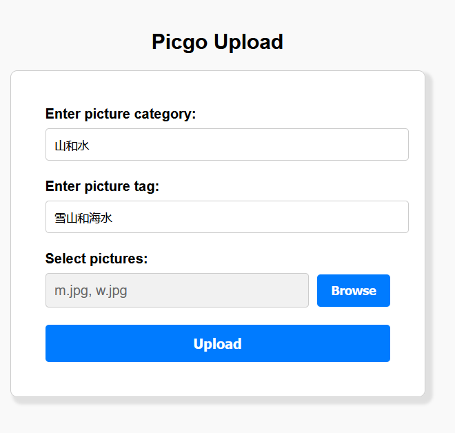

### 关于Picgo集成

    -- 关于集成picgo的一个实现

#### 需求

1、开发测试环境:`github`

2、生产环境:`aliyun oss`

3、作为项目图片存储解决方案

#### 想法

在查阅了相关文档后，发现`Picgo`提供了集成到`nodejs`项目功能，同时允许通过配置文件定向上传到指定图床仓库，因此可以通过接口直接集成到现有`express`项目当中

> 默认配置文件

相关配置文件目录:`~/.picgo/config.json`，由于集成性，建议直接在项目初始化`picgo`时指定项目中的配置文件：

```javascript
const Picgo = require('picgo')
const picgo = new Picgo('/path/to/config')
```

> github图床配置

```json
{
    "picBed": {
        "uploader": "github",
        "github": {
            "repo": "<username>/<reponame>",
            "token": "<github-token>",
            "path": "img/",
            "customUrl": "<custom-url>",
            "branch": "<branch>"
        }
    },
    "picgoPlugins": {}
}
```

> aliyun图床配置

```json

{
    "picBed": {
        "accessKeyId": "",
        "accessKeySecret": "",
        "bucket": "",
        "area": "",
        "path": "",
        "customUrl": "",
        "options": ""
    },
    "picgoPlugins": {}
}
```

#### 实现过程

1、相关接口

接口名：Picgo集成

主要作用：实现图片上传到图床后自动映射到数据库

请求路径：`/upload`

请求方法：`POST`

请求参数：

`Content-type: multipart/form-data`

```json
{
    "category": string,
    "tag": string,
    "images": files
}
```

响应：

```json
{
    "success": bool,
    "message": string
}
```

2、编写实现逻辑，结合express实现映射

3、测试接口

测试样例：



测试结果：

```js
{
    category: "山和水",
    tag: "雪山和海水",
    images: [
        '...',
        '...'
    ]
}
```

4、修改问题，优化接口调用


#### 使用

1、clone仓库到本地

`git clone git@github.com:2311719626/CCCC_Pic.git`

2、进入`src`目录，安装依赖

`cd CCCC_Pic/src && npm i`

3、在项目根目录下创建图床配置文件

`touch picgo.json`

4、在`src`目录运行项目，使用浏览器访问`http://localhost:3000`

`npm start`